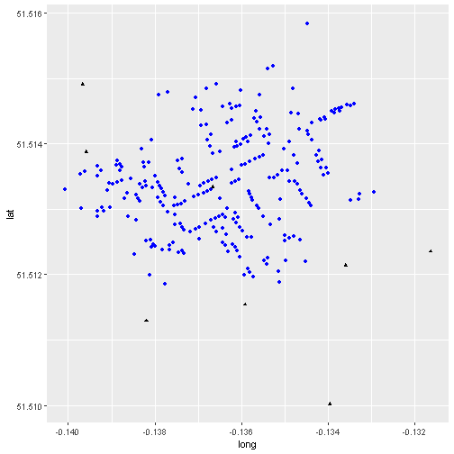

Presentation
========================================================
author: Parmanand Sinha
date: 
autosize: true

Topics
========================================================

- Representing geographical data in R
- dataset
- Finding non-randomness in point maps using spatstat

- Detection and measurement of spatial autocorrelation in lattice data using spdep

- Creating contour-type maps and semivariance using inverse distance weighting and geostatistical methods using gstat

First Slide
========================================================

For more details on authoring R presentations please visit <https://support.rstudio.com/hc/en-us/articles/200486468>.

- Bullet 1
- Bullet 2
- Bullet 3

Slide With Code
========================================================


```r
summary(cars)
```

Data set
========================================================

```
  X       long      lat Id Count
1 0 -0.1379301 51.51342  1     3
2 1 -0.1378831 51.51336  2     2
3 2 -0.1378529 51.51332  3     1
4 3 -0.1378120 51.51326  4     1
5 4 -0.1377668 51.51320  5     4
6 5 -0.1375369 51.51318  6     2
```

```
     X       long      lat  Id Count
1    1 -0.1366679 51.51334 251     1
2 1100 -0.1395862 51.51388 252     1
3  250 -0.1396710 51.51491 253     1
4  310 -0.1316299 51.51235 254     1
5  410 -0.1335944 51.51214 255     1
6  510 -0.1359191 51.51154 256     1
```

Point Patterns
========================================================


- A point pattern is a statistical map where the location of the event is the outcome of a process 
- A point pattern is given by a set of events of interest that are observed in a region $R$
- A region has an infinite number of points (coordinates) on the plane 
- Point patterns must be a complete _enumeration_ meaning every event that happened has been recorded

Processes and Point Patterns
========================================================
-  A key question of interest is whether the pattern is random
- Non-random patterns are likely the outcome of some meaningful process
- Deciding whether the pattern is random or not is the initial step towards developing hypotheses about the underlying process 

Tidyverse and plotting
========================================================
'Tidyverse' is a collection of R packages designed for data science used in everyday data analyses  


```r
library(pacman)
p_load(tidyverse)
```


The function 'ggplot' is used for data visualization - it creates a graph. The function 'geom_point' tells R you want to create a plot of points. 'data = snow_deaths' tells R you want to use the 'snow_deaths' dataframe. 'aes' stands for aesthetics of your graph where 'x = long' sets the x axis to 'long', where 'y = lat' sets the y axis to 'lat', where 'color = blue' colours the points blue and 'shape = 16' assigns the shape of the points - in this case, '16' are circles and '17' are triangles  


```r
ggplot() +
  geom_point(data = snow_deaths, aes(x = long, y = lat), color = "blue", shape = 16) +
  geom_point(data = snow_pumps, aes(x = long, y = lat), color = "black", shape = 17)
```


